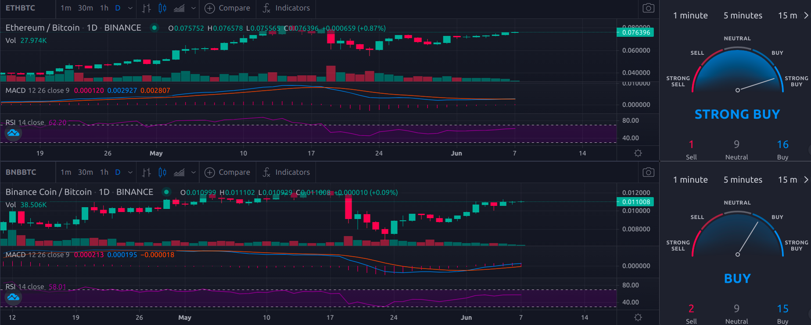

# Trade Visualization

*View Multiple Trade View Charts And Signals On A Single Chrome Tab*

(prototype)
### Description
- loads mulitple asset/quote pairs from a json file and displays the trading data of a browser tab
- Helpful for analysing multiple assets at once
- The chart and technical analysis of every pair is displayed side by side (widgets from [Tradingview](https://www.tradingview.com/))
- Every page can have a maximum of 25 pairs by default (can be changed)
- Arrow keys can be used to switch between pages
___
### View

___

### How To Run
navigate to the project direcotory and run 

`uvicorn graphs:app`
___
### dependencies
- starlette==0.14.1
- uvicorn==0.13.3
